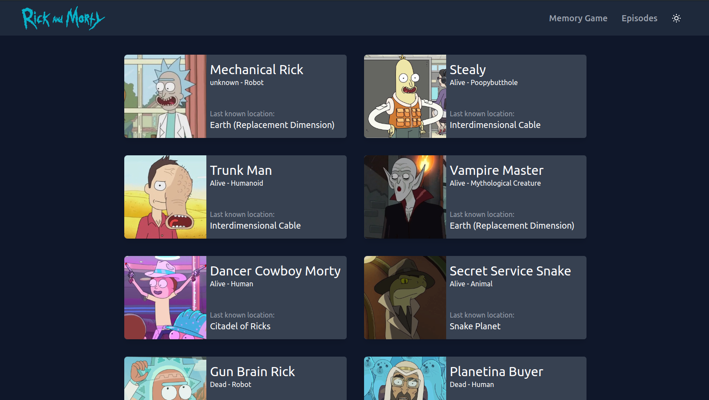
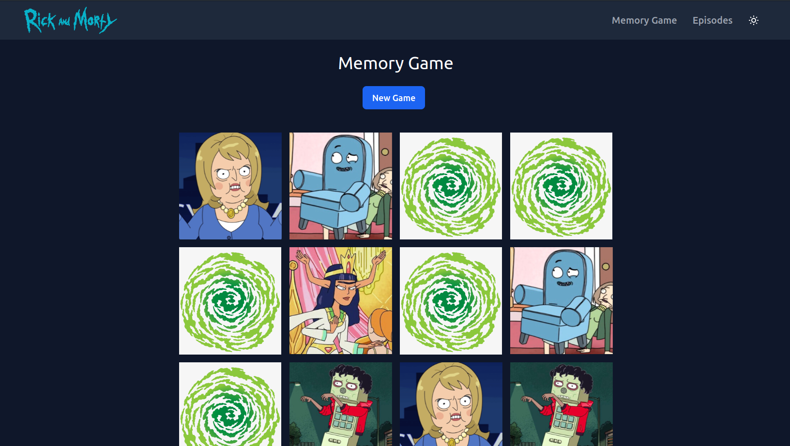

# Rick and Morty

[**Rick and Morty**](https://rickand-morty-murex.vercel.app "**Rick and Morty**") is a web site where you will find all the characters, images, locations and episodes from your favorite tv show, play memory game.





## Installation  
```
npm install
```

## How to run 
```
npm run start
```

Runs the app in the development mode.

Open [http://localhost:3000](http://localhost:3000) to view it in your browser.

The page will reload when you make changes.
You may also see any lint errors in the console.

## License
MIT
